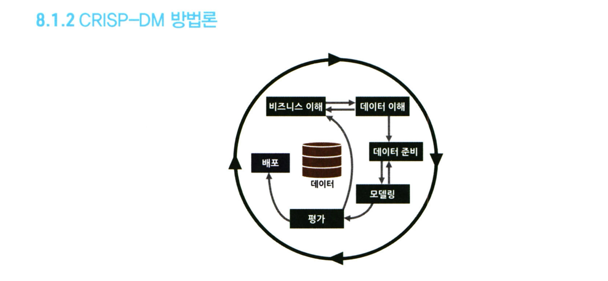

# 통계학 3주차 정규과제

📌통계학 정규과제는 매주 정해진 분량의 『*데이터 분석가가 반드시 알아야 할 모든 것*』 을 읽고 학습하는 것입니다. 이번 주는 아래의 **Statistics_3rd_TIL**에 나열된 분량을 읽고 `학습 목표`에 맞게 공부하시면 됩니다.

아래의 문제를 풀어보며 학습 내용을 점검하세요. 문제를 해결하는 과정에서 개념을 스스로 정리하고, 필요한 경우 추가자료와 교재를 다시 참고하여 보완하는 것이 좋습니다.

2주차는 `2부-데이터 분석 준비하기`를 읽고 새롭게 배운 내용을 정리해주시면 됩니다.


## Statistics_3rd_TIL

### 2부. 데이터 분석 준비하기
### 08. 분석 프로젝트 준비 및 기획
### 09. 분석 환경 세팅하기


## Study Schedule

|주차 | 공부 범위     | 완료 여부 |
|----|----------------|----------|
|1주차| 1부 p.2~56     | ✅      |
|2주차| 1부 p.57~79    | ✅      | 
|3주차| 2부 p.82~120   | ✅      | 
|4주차| 2부 p.121~202  | 🍽️      | 
|5주차| 2부 p.203~254  | 🍽️      | 
|6주차| 3부 p.300~356  | 🍽️      | 
|7주차| 3부 p.357~615  | 🍽️      |  

<!-- 여기까진 그대로 둬 주세요-->

# 08. 분석 프로젝트 준비 및 기획

```
✅ 학습 목표 :
* 데이터 분석 프로세스를 설명할 수 있다.
* 비즈니스 문제를 정의할 때 주의할 점을 설명할 수 있다.
* 외부 데이터를 수집하는 방법에 대해 인식한다.
```
<!-- 새롭게 배운 내용을 자유롭게 정리해주세요.-->
>### 8.1 데이터 분석 전체 프로세스
```
데이터 분석의 궁극적인 목표
: 보다 효과적인 결정을 할 수 있도록 도움을 주는 것
```
- 데이터 분석 프로젝트의 전체 프로세스
    
    ```
    1. 설계 단계

    데이터 분석에 들어가기에 앞서 무엇을 하고자 하는지를 명확히 정의하고 프로젝트를 수행할 인력을 구성

    2. 분석 및 모델링 단계

    모델의 비즈니스적 적합성을 분석하고 성능을 평가하는 것이 중요(CRISP-DM, SEMMA 방법론)

    3. 구축 및 활용 단계

    최종적으로 선정된 분석 모델을 실제 업무에 적용하고 그 성과를 측정함(A/B테스트)
    ```

- CRISP-DM 방법론

    

    ```
    단계
    1. 비즈니스 이해(Business understanding)
    2. 데이터 이해(Data Understanding)
    3. 데이터 준비(DATA PREPARATION)
    4. 모델링(MODELLING)
    5. 평가(EVALUATION)
    6. 배포(DEPLOYMENT)
    ```
결국 **핵심**은 동일하다.
- 초반부: 비즈니스 문제와 해결 방향을 명확히 정의하고 데이터를 탐색

- 중반부: 데이터를 목적에 맞도록 수집 및 가공하고 필요에 따라 머신러닝 모델을 사용

- 후반부: 데이터 분석 결과를 검토 및 검증하고 실제 환경에 적용

그 이후에는 적용한 방법의 효과를 지속적으로 모니터링하고 성과를 측정하고 보완하는 단계가 수반되어야 함

>### 8.2 문제 정의 및 목적 도출

- Why? 
    ```
    목적이 불명확한 대부분의 데이터 분석 프로젝트는 제대로 된 성과를 얻지 못함

    비즈니스 이해 및 문제 정의가 조금이라도 잘못되면 최종 인사이트 도출 및 솔루션 적용 단계에서 제대로 된 효과를 보기 힘듦
    ```

- **MECE 방법론** : 비즈니스 문제를 정의하기 위한 논리적 접근법
    ```  
    일반적으로 로직 트리(Logic Tree)를 활용하여 세부 항목을 정리
    
    세부 항목들은 서로 중복되지 않으면서 상위 항목 전체를 포함하고 있어야 함
 
    ```
    

-  페이오프 매트릭스(Pay off Matrix): : 과제의 수익성과 실행 가능성 수준에 따라 2×2 네 개의 분면에 과제 우선순위를 표현
    
    
    ```
    - 최종 실행 과제 
    : 실행가능성과 사업성과 모두를 충족하는 1번 영역인 Grand Slam에 포함되는 세부과제를 우선 선정

    - 중장기 과제
    :  Extra Innings에 해당하는 것 중 일부를 선정
    
    - Stolen Base와 Strike Out에 해당되는 과제는 제외
    ```

>### 8.3  분석 목적의 전환
- 실제 분석을 하기 전 까지 정보와 인사이트를 알기 어려움
- PoC나 간단한 Sample Data 탐색을 하면 좋지만 어려움
- **그렇기에 분석 프로젝트의 방향이 언제든 바뀔 수 있음을 염두해야함**


>### 8.4 도메인 지식

    도메인 지식이 없을 경우 문제점:
    (1) 문제 정의와 분석 목적이 1차원적일 수밖에 없음
    (2) 분석 결과가 어떠한 의미를 가지는지, 어떻게 활용될 수 있는지 알기 힘듦
    (3) 직접 의미 있는 변수를 찾아내고 분석 방향을 설정하는 것은 도메인 지식이 충분하게 수반됐을 때 가능

    도메인 지식을 효과적으로 습득할 수 있는 방법 :

    1. 프로젝트 초반에, 비즈니스 도메인에 소속된 실무자와 잦은 미팅과 함께 적극적인 질문과 자료 요청이 필요

    2. 관련 논문들을 참고하여 해당 도메인에 대한 심도 있는 지식을 습득 (수행하는 프로젝트와 유사한 주제의 논문에서 사용됐던 방법론을 위주로 보는 것이 좋음)

    3. 현장에 방문해 데이터가 만들어지는 과정을 직접 보는 것이 많은 도움이 됨
    ```
- 직접 의미 있는 변수를 찾아내고 분석 방향을 설정 하는 것은 도메인 지식이 수반되어야 가능하다!!

>### 8.5 외부 데이터 수집
- 프로세스


- 수집하는 방법
    ```
    1.  데이터를 판매하는 전문 기업으로부터 필요한 데이터를 구매하거나 MOU 등을 통해 데이터를 공유하는 방법

    특징 :
    - 비용이 많이 듦
    - 절차가 복잡함
    - 정제된 고품질의 데이터를 얻을 수 있음

    2. 공공 오픈 데이터를 제공하는 사이트에서 엑셀이나 csv 형태로 데이터를 받아서 활용하는 방법

    특징 :
    - 데이터 수집에 특별한 비용이나 노력이 크게 들어가지 않음
    - 데이터를 원하는 형태로 가공하기 위한 리소스가 많이 듦
    - 활용성이 높은 데이터를 얻을 확률이 낮음
    - 자체적으로 큰 가치를 가진 데이터가 적음

    3. 웹에 있는 데이터를 크롤링하여 수집하는 방법

    - 데이터를 실시간으로 자유롭게 수집할 수 있음
    - 데이터 수집을 위한 프로그래밍이 필요
    - 해당 웹페이지가 리뉴얼되면 이에 맞춰 수집 코드도 수정해야 함
    - 법적인 이슈도 함께 고려해야 함

    웹 크롤링 v.s 스크래핑

    - 크롤링은 웹 페이지가 주어지면 그 페이지 내에 있는 링크들을 따라가면서 모든 내용을 다 가져오는 것

    - 스크래핑은 웹 페이지에서 자신이 원하는 부분의 정보만 가져오는 것
    ```
# 09. 분석 환경 세팅하기

```
✅ 학습 목표 :
* 데이터 분석의 전체적인 프로세스를 설명할 수 있다.
* 테이블 조인의 개념과 종류를 이해하고, 각 조인 방식의 차이를 구분하여 설명할 수 있다.
* ERD의 개념과 역할을 이해하고, 기본 구성 요소와 관계 유형을 설명할 수 있다.
```

<!-- 새롭게 배운 내용을 자유롭게 정리해주세요.-->
>### 9.2 데이터 처리 프로세스 이해하기
- 데이터분석가는 분석 역량 뿐 아니라 서버 환경에 대해서도 어느정도 알고 있어야 한다


 ```
1. OLTP(On-Line Transaction Processing)
: 실시간으로 데이터를 트랜잭션 단위로 수집, 분류, 저장하는 시스템
    
2. DW(Data Warehouse)
: 수집된 데이터를 사용자 관점에서 주제별로 통합하여 쉽게 원하는 데이터를 빼낼 수 있도록 저장해 놓은 통합 데이터베이스

3. DM(Data Mart)
: 사용자의 목적에 맞도록 가공된 일부의 데이터가 저장되는 곳

- ETL(Extract, Transform, Load)
: 저장된 데이터를 사용자가 요구하는 포맷으로 변형하여 이동시키는 작업 과정

- Extract(추출)
: 원천 소스 데이터베이스로부터 필요한 데이터를 읽어 들이는 과정

- Transform(변환)
: 미변환 상태의 raw 데이터를 정리, 필터링, 정형화하고 요약하여 분석에  
    적합한 상태로 바꾸어 놓는 과정
- Load(불러내기)
    : 변환된 데이터를 새로운 테이블(목표 시스템)에 적재하는 과정
```
>### 9.3 분산 데이터 처리
    
    말 그대로 한 컴퓨터가 처리해야 할 일을 여러 컴퓨터가 나눠서 한 다음 그 결과를 합치는 것

    scale-up
    : 하나의 컴퓨터의 용량을 늘리고 더 빠른 프로세서를 탑재하는 것

    - 데이터의 크기가 커지게 되면 속도가 급격히 느려짐

    scale-out
    : 분산데이터 처리처럼 여러 대의 컴퓨터를 병렬적으로 연결하는 것

    - 여러 대의 컴퓨터가 함께 연산을 하기 때문에 효율이 훨씬 높음

    무조건 컴퓨터를 병렬로 연결한다고 해서 데이터 처리가 빨라지지는 않음
    -> 연결된 컴퓨터들이 효율적으로 데이터를 나눠서 처리하고 결과를 취합할 수 있는 기술이 있어야 함

- HDFS
    ```
    슬레이브 노드(Slave node), 마스터 노드(Master node), 클라이언트 머신(Client machines) 세 가지 모듈로 나뉨

    - 슬레이브 노드
    : 데이터를 저장하고 계산하는 세부적인 역할

    - 마스터 노드
    :  대량의 데이터를 HDFS에 저장하고 맵리듀스 방식을 통해 데이터를 병렬 처리

    - 클라이언트 머신
    : 맵리듀스 작업을 통해 산출된 결과를 사용자에게 보여주는 역할을 함
    ```

- 맵리듀스
    ```
    맵(Map)과 리듀스(Reduce)라는 두 단계로 구성됨

    - 맵
    : 흩어져 있는 데이터를 관련된 데이터끼리 묶어서 임시의 집합을 만드는 과정

    - 리듀스
    : 필터링과 정렬을 거쳐 데이터를 뽑아냄

    key-value 쌍으로 데이터를 처리하는 것이 맵리듀스의 중요한 특징임

    맵리듀스의 세부 단계 :

    - 분할(spliting)
    : 입력된 데이터를 고정된 크기의 조각으로 분할
    
    - 매핑(mapping)
    : 분할된 데이터를 key-value 형태로 묶어주고 단어 개수를 계산

    - 셔플링(shuffling)
    : 매핑 단계의 counting 결과를 정렬 및 병합

    - 리듀싱(reducing)
    : 각 결과를 취합 및 계산하여 최종 결괏값을 산출
    ```

>### 9.4 테이블 조인과 정의서 그리고 ERD
#### 조인 : 여러개의 테이블을 공통 칼럼으로 조합하는 것
    
    1. 이너 조인(inner join)
    2. 아우터 조인(outer join)
    3. 레프트 조인(left join)
    4. 라이트 조인(right join)
    5. 풀 조인(full join)
    6. 크로스 조인(cross join)
    

- 레프트, 라이트 조인

    ```
    하나의 테이블 기준으로 다른테이블에서 겹치는 부분을 결합  
    일치하는 키 값이 없으면 결측값  
    하나의 키에 여러개의 관측치가 존재하면 행이 늘어남
    ```

- 이너, 풀조인

    ```
    이너조인 : 교집합만 가져옴
    풀조인 : 모든 행을 살린다, 조인되지 않는 부분은 결측값이 됨
    ```
- 크로스 조인

    ```
    머신러닝에서 데이터셋 생성할 때 사용함
    eg)
    자동차 기업에서 고객별로 각 차량의 구매확률을 구하는 모델을 만든다고 가정

    구매 예측 대상 차량이 5종이라면
    고객별로 5개 차량에 대한 모든 독립변수와 종속변수가 만들어져야 함
    ```
#### ERD : 각 테이블의 구성정보 및 테이블간 관계를 도식화한 것
    
    테이블 = 엔티티(Entity)
    
    - 각 테이블이 어떤 테이블과 어떤 키로 연결되어 있는지 직관적으로 확인할 수 있음

    물리(physical)와 논리(logical)로 구분됨

    - 물리
    : DB를 효율적이고 결점 없이 구현하는 것을 목표로 구현하는 ERD 개념

    - 논리
    : 데이터 사용자 입장에서 테이블 간 매핑(Mapping)에 오류가 없으며 데이터의 정규화가 이루어진 ERD의 개념

    ERD의 핵심은 테이블 간 연결을 해주는 '키 칼럼'과 연결 관계를 의미하는 '식별자'

    - 키 칼럼
    : 고객번호처럼 ID와 같은 개념으로 기본 키(Primary Key)와 외래 키(Foreign Key)로 구분됨

    기본 키 v.s 외래 키

    기본 키
    : 테이블에 적재된 각각의 데이터를 유일하게 구분하는 키
    
    - 해당 테이블에서 유일하게 구분되는 칼럼이므로 중복될 수 없으며 결측값을 가질 수 없음
    
    외래 키
    : 각 테이블 간에 연결을 만들기 위해서 테이블에서 다른 테이블의 참조되는 기본 키
    다른 테이블과 연결하기 위한 칼럼이므로 중복이나 결측값이 있을 수 있음

    자식 테이블
    : 외래 키가 정의된 테이블
    
    부모 테이블
    : 외래 키가 참조되는 테이블
    

<br>
<br>

# 확인 문제

## 문제 1.

> **🧚 아래의 테이블을 조인한 결과를 출력하였습니다. 어떤 조인 방식을 사용했는지 맞춰보세요.**

> 사용한 테이블은 다음과 같습니다.

|
---|---|
> 보기: INNER, LEFT, RIGHT 조인

<!-- 테이블 조인의 종류를 이해하였는지 확인하기 위한 문제입니다. 각 테이블이 어떤 조인 방식을 이용하였을지 고민해보고 각 테이블 아래에 답을 작성해주세요.-->

### 1-1. 

```
여기에 답을 작성해주세요!
```

### 1-2. 

```
여기에 답을 작성해주세요!
```

### 1-3. 

```
여기에 답을 작성해주세요!
```

### 🎉 수고하셨습니다.