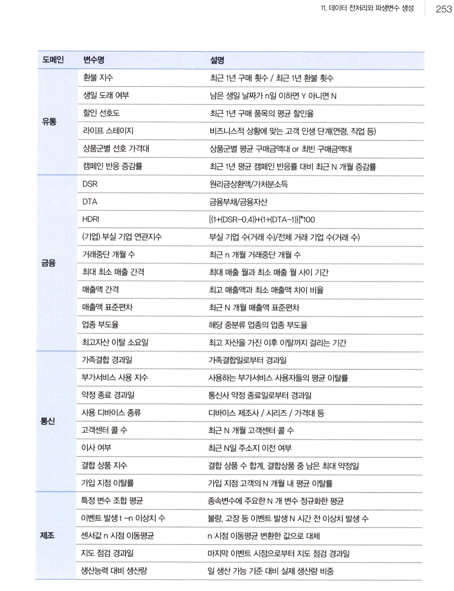
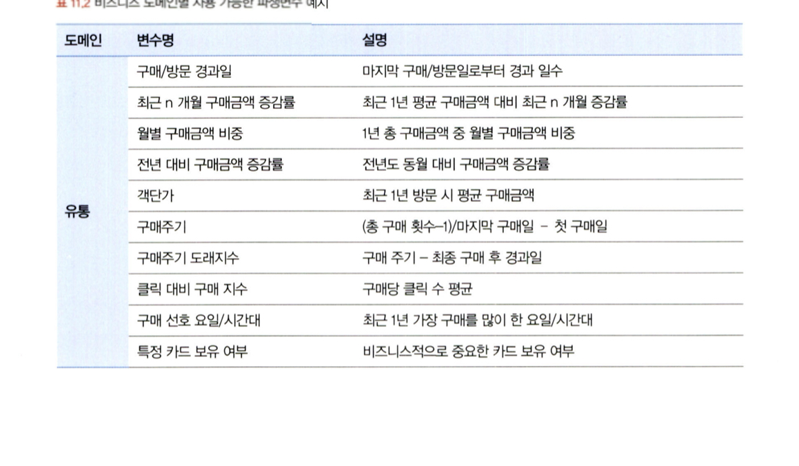

# 통계학 5주차 정규과제

📌통계학 정규과제는 매주 정해진 분량의 『*데이터 분석가가 반드시 알아야 할 모든 것*』 을 읽고 학습하는 것입니다. 이번 주는 아래의 **Statistics_5th_TIL**에 나열된 분량을 읽고 `학습 목표`에 맞게 공부하시면 됩니다.

아래의 문제를 풀어보며 학습 내용을 점검하세요. 문제를 해결하는 과정에서 개념을 스스로 정리하고, 필요한 경우 추가자료와 교재를 다시 참고하여 보완하는 것이 좋습니다.

5주차는 `2부. 데이터 분석 준비하기`를 읽고 새롭게 배운 내용을 정리해주시면 됩니다.


## Statistics_5th_TIL

### 2부. 데이터 분석 준비하기
### 11.데이터 전처리와 파생변수 생성


## Study Schedule

|주차 | 공부 범위     | 완료 여부 |
|----|----------------|----------|
|1주차| 1부 p.2~56     | ✅      |
|2주차| 1부 p.57~79    | ✅      | 
|3주차| 2부 p.82~120   | ✅      | 
|4주차| 2부 p.121~202  | ✅      | 
|5주차| 2부 p.203~254  | ✅      | 
|6주차| 3부 p.300~356  | 🍽️      | 
|7주차| 3부 p.357~615  | 🍽️      | 

<!-- 여기까진 그대로 둬 주세요-->

# 11.데이터 전처리와 파생변수 생성

```
✅ 학습 목표 :
* 결측값과 이상치를 식별하고 적절한 방법으로 처리할 수 있다.
* 데이터 변환과 가공 기법을 학습하고 활용할 수 있다.
* 모델 성능 향상을 위한 파생 변수를 생성하고 활용할 수 있다.
```


## 11.1. 결측값 처리

**결측값 유형**

- MCAR (Missing Completely at Random): 결측이 완전히 무작위

- MAR (Missing at Random): 다른 변수에 따라 결측 발생

- NMAR (Not Missing at Random): 해당 변수의 특성에 따라 결측 발생


**결측값 처리**

- 제거: dropna() 함수 사용

- 평균 대치: 평균으로 결측 대체 (오차 축소 위험)

- 보간법: 시계열 데이터에 적합

- 회귀 대치: 타 변수로 회귀 예측

- 다중 대치법 (Multiple Imputation):

- MICE, MCMC 기법으로 n개의 대치 데이터셋 생성, 각각 분석 후 평균 결합


>### ✅ 결측값 처리 실습

**dropna()**
```
# 모든 컬럼이 결측값인 행 제거
df.dropna(how='all')

# 하나라도 결측값이 있으면 해당 행 제거
df.dropna(how='any')

# 특정 컬럼 기준으로 결측값이 있는 행만 제거
df.dropna(subset=['컬럼명'])
```

**📍결측치 시각화 함수**
```
import missingno as msno
msno.matrix(df)
plt.show()
```

**결측치 대치 : fillna()**
```
# 특정값 대치
df_0_all = df.fillna(0)

# 평균 대치
df = df.fillna(df.mean())

# 최빈값, 최댓값 대치
df = df.fillna(df.mode())
df = df.fillna(df.max())
```

**보간법**
```
df = df.fillna(method = 'pad') # 전시점 값
df = df.fillna(method = 'bfill') # 뒤 시점 값으로 대치

# 시간 보간법
df['칼럼'] = pd.to_datetime(df['칼럼'])
df1 = df.set_index('칼럼')
df1 = df1.interpolate(method='time')
```


## 11.2. 이상치 처리


**이상치란**: 정상적인 범주를 벗어나 모델의 학습 및 해석에 왜곡을 줄 수 있는 극단값을 의미한다.

**이상치 처리의 필요성**:
데이터 양이 많을수록 통계량에 대한 이상치의 영향력은 작아지지만, 실제 데이터에는 오입력 또는 예측 성능 저하의 원인이 되는 이상치가 빈번하게 존재한다. 따라서 사전 탐색과 적절한 처리 후 모델링에 사용하는 것이 일반적인 절차다.

**도메인 지식 중요성**: 분석 도메인에 따라 이상치가 중요한 분석 요인일 수 있음


---

**이상치 탐색 방법**

```
- 기초통계량(평균, 중위수, 표준편차 등)을 활용한 범위 분석
- 박스플롯을 통한 시각적 탐지
- 도메인 지식을 활용한 명확한 기준 설정
```

**이상치 처리 방법**

```
- 제거: 이상치를 직접 제거하여 모델 안정성 확보 (단, 정보 손실 발생 가능)
- 대체: 상·하한값으로 변경하여 극단값 효과 완화
- 가중치 조정: 이상치에 낮은 가중치를 부여하여 모델 영향 최소화
```


>### ✅ 이상치 처리 실습

**1. 박스플롯을 활용한 이상치 탐색**

```
# 시각화를 통해 이상치 분포 파악
import seaborn as sns
import matplotlib.pyplot as plt

plt.figure(figsize=(8, 5))
sns.boxplot(x='컬럼명', data=df)
plt.show()
```

**2. IQR 기준을 이용한 이상치 제거**

```
# IQR 계산 및 필터링
Q1 = df['컬럼명'].quantile(0.25)
Q3 = df['컬럼명'].quantile(0.75)
IQR = Q3 - Q1

# 일반 기준: 1.5 * IQR, 실무에서는 3 * IQR도 사용
lower_bound = Q1 - 1.5 * IQR
upper_bound = Q3 + 1.5 * IQR

df_filtered = df[(df['컬럼명'] >= lower_bound) & (df['컬럼명'] <= upper_bound)]
```

---

## 11.3. 변수 구간화(Bining)

**정의**:
연속형 변수를 일정 기준으로 나누어 범주형 또는 이산형으로 변환하는 과정이다. 이는 해석 용이성 향상뿐 아니라 모델 성능 향상에도 기여할 수 있다.

**구간화 방식**
- 동일 폭 구간화 (equal-width): 각 구간의 간격을 일정하게 나눔
- 동일 빈도 구간화 (equal-frequency): 각 구간에 포함되는 데이터 수를 균등하게 나눔
- 구간별 평균(중앙, 경계) 값으로 평활화 = Smoothing, 시계열 데이터에서 사용함...
- 비즈니스 로직 기반 수동 구간화: 도메인 지식 반영
- 클러스터링 기반 자동 구간화: KMeans 등 사용

**구간화가 잘 되었나?**
- WOE값 : 범주별 정보량 정량화
- IV값 -> 높을 수록 T/F를 잘 구분함, 로지스틱 회귀에서 파생 개념

**평활화 (Smoothing) 기법**:  구간 내 데이터를 평균, 중앙값, 경곗값으로 변환하여 노이즈를 줄임

>### ✅ 구간화 실습

1. WOE
```
!pip install xverse
from xverse.transformer import WOE

# BMI 시각화 및 분포 확인 수행 및 구간화 수행 햇다 가정
df2 = pd.get_dummies(df)
X = df2['구간화할 칼럼']
y= df2['기준칼럼']
clf = WOE()
clc.fit(X,y)

a = clf.woe_df
b= clf.iv_df
a.head()
```


## 11.4. 데이터 표준화와 정규화 스케일링

**1. 표준화 (Standardization)**

```
- Z-score 방식
- 평균 0, 표준편차 1로 변환
- 이상치에 민감함
```

**2. 정규화 (Normalization)**

```
- 0~1 사이 범위로 조정 (min-max scaling)
- 변수 범위를 직접적으로 압축함
- 이상치에 매우 민감함
```

**3. Robust Scaler**

```
- 중앙값과 IQR 기반 스케일링
- Q2를 -으로 Q1, Q3의 IQR 차이를 1이 되도록 하는 스케일링 기법
- 이상치 영향 최소화
```

> 거리 기반 알고리즘(KNN, SVM) 및 신경망 계열 모델에서는 스케일링 필수

>### ✅ 정규화 실습
1. MinMaxScaler()
```
from sklearn.preprocessing import StandardScaler, MinMaxScaler, RobustScaler
MinMax = MinMaxScaler()
df_minmax = MinMax.fit_transform(df)


## 11.5. 파생 변수 생성

**정의**:
기존 데이터를 변형하거나 조합하여 새로운 정보를 가진 변수를 생성하는 과정. 이는 모델 예측력을 높이는 핵심 전략 중 하나다.

**파생변수 생성 시 고려사항**

- **도메인 지식 기반**: 단순 조합이 아닌 실제 의미 있는 변수 생성 필요, data에 대한 파악이 매우 중요함!!
- 데이터 탐색 기반: 시각화, 통계량 검토를 선행하여 특징 포착
- 다중공선성 검토: 기존 변수와 상관성 높을 경우 변수 제거 또는 PCA 고려
```
**예시**




<br>
<br>


---

# 확인 문제

## 문제 1. 데이터 전처리

> **🧚 한 금융회사의 대출 데이터에서 `소득` 변수에 결측치가 포함되어 있다. 다음 중 가장 적절한 결측치 처리 방법은 무엇인가?**

> **[보기]   
1️⃣ 결측값이 포함된 행을 모두 제거한다.  
2️⃣ 결측값을 `소득` 변수의 평균값으로 대체한다.  
3️⃣ `연령`과 `직업군`을 독립변수로 사용하여 회귀 모델을 만들어 `소득` 값을 예측한다.  
4️⃣ 결측값을 보간법을 이용해 채운다.**

> **[데이터 특징]**     
    - `소득` 변수는 연속형 변수이다.  
    - 소득과 `연령`, `직업군` 간에 강한 상관관계가 있다.  
    - 데이터셋에서 `소득` 변수의 결측 비율은 15%이다.

**정답**
```
주어진 데이터는 연령, 직업군과 소득 간에 강한 상관관계가 존재하므로, 이 관계를 활용해 결측값을 예측하는 회귀 대치법(regression imputation)이 적절하다.

다른 선택지의 문제점:

1번: 15%는 결코 무시할 수 없는 수준의 손실을 유발함.

2번: 평균 대치는 분산을 과소추정하고 p-value 왜곡 우려가 있다.

4번: 보간법은 시계열 데이터에 적합하며 본 문맥과 부적합하다.
```

## 문제 2. 데이터 스케일링

> **🧚 머신러닝 모델을 학습하는 과정에서, `연봉(단위: 원)`과 `근속연수(단위: 년)`를 동시에 독립변수로 사용해야 합니다. 연봉과 근속연수를 같은 스케일로 맞추기 위해 어떤 스케일링 기법을 적용하는 것이 더 적절한가요?**

<!--표준화와 정규화의 차이점에 대해 고민해보세요.-->
**정답**: 표준화
```
정규화는 이상치에 더 민감하여 이상치(고연봉자 등)가 전체 스케일을 왜곡하기 쉽다.

표준화는 거리 기반 알고리즘(KNN, SVM 등)에서 특히 필수적이며, 일반적인 수치형 변수 간 스케일 차이를 해소하는 데 가장 효과적이다.

만약 이상치가 많다면, Robust Scaler를 고려할 수 있다.

```

### 🎉 수고하셨습니다.